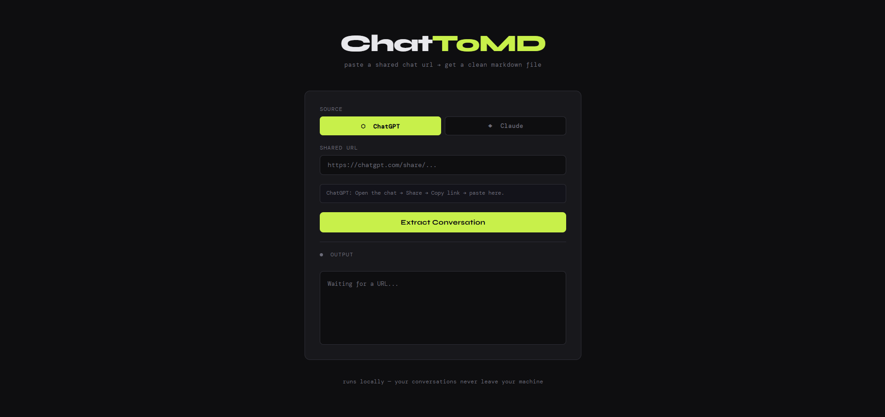

# ChatToMD: AI Conversation Exporter

> Export shared ChatGPT and Claude conversations to clean Markdown files. Paste a public share link, get a structured `.md` file. No extensions, no accounts required.

[Live Demo](https://chattomd.onrender.com) &nbsp;|&nbsp; [Report an Issue](https://github.com/Srijani-Das07/ChatToMD/issues)

---



---

## Overview

ChatGPT and Claude both support sharing conversations via public links, but neither provides a native way to export them as a portable file. Copy-pasting loses structure. Browser extensions require installation and permissions.

ChatToMD solves this: paste a share link, and the app fetches the conversation, parses it, and returns a clean `.md` file, ready to save, share, or reference.

---

## Usage

1. Open a conversation in ChatGPT or Claude
2. Use the **Share** option to generate a public link
3. Paste the link into ChatToMD and select the source
4. Click **Extract Conversation** and download the `.md` file

> Only works with **public** share links.

---

## How It Works

ChatToMD runs a headless browser in the background, loads the shared page, and intercepts the conversation data before it's rendered; no scraping, no fragile DOM parsing.

For a detailed technical breakdown, see [ARCHITECTURE.md](ARCHITECTURE.md).

---

## Self-Hosting

**Prerequisites:** Node.js v18+, Google Chrome

```bash
git clone https://github.com/Srijani-Das07/ChatToMD.git
cd ChatToMD
npm install
npm start
```

Open `http://localhost:3000`.

---

## Known Limitations

- Conversations containing code blocks may not extract completely [fix in progress]
- Only public share links are supported
- If ChatGPT or Claude changes their page or API structure, the parser may need an update

---

## Technologies

Node.js · Express · Puppeteer · HTML/CSS/JS

---

## Author

[Srijani Das](https://github.com/Srijani-Das07)

---

## License

Released under the [MIT License](LICENSE).